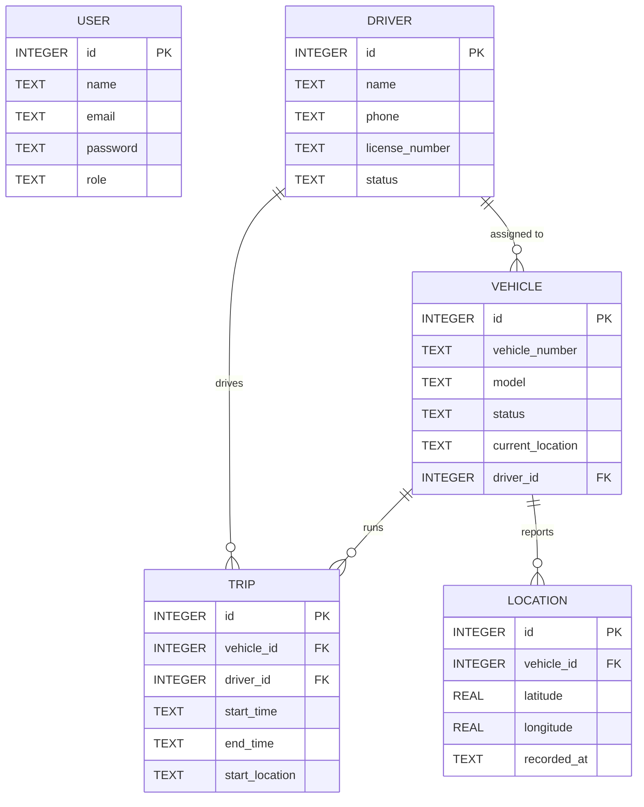
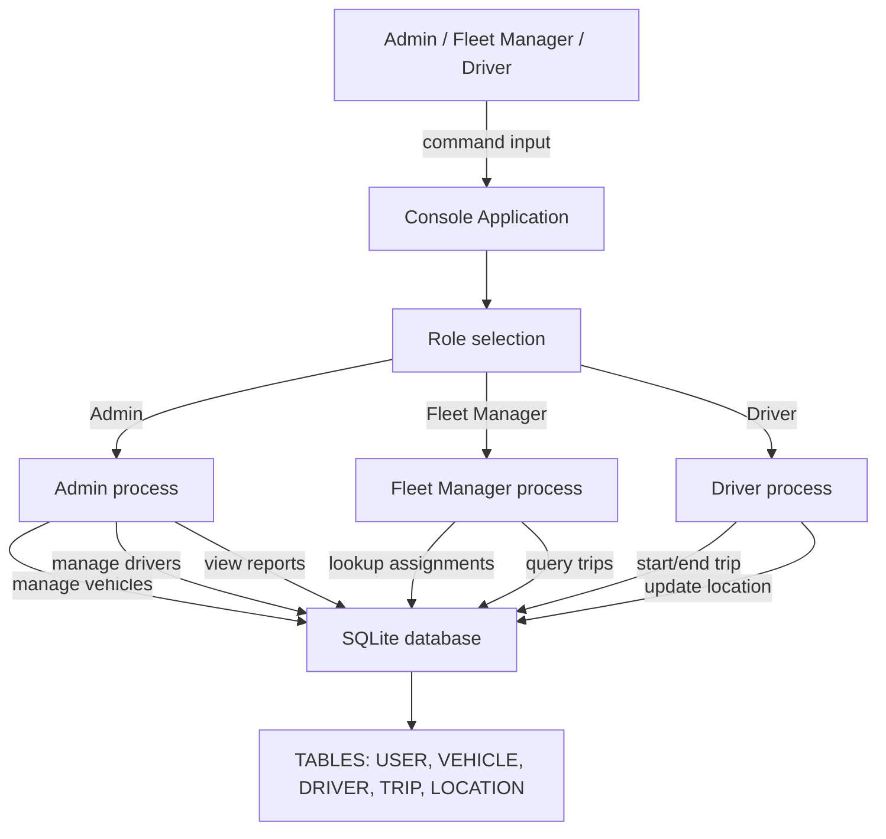
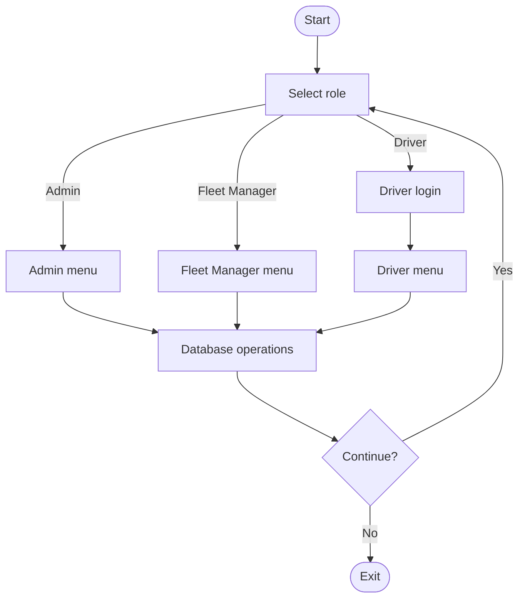

# Vehicle Tracking and Fleet Monitoring System

## Project Statement
This project implements a backend-only fleet management console application that supports vehicle tracking, driver assignment, trip management, and location reporting. It is designed as a capstone system to demonstrate database-backed fleet monitoring workflows using a CLI interface and SQLite storage.

## MVP Overview
This capstone project is a console-based backend system for vehicle tracking and fleet monitoring. It includes vehicle registration, driver assignment, trip logging, location reporting, and fleet summary via a CLI menu.

## MVP Scope
- Vehicle registration and status tracking
- Driver profiles and assignment
- Trip logging and summary
- Location reporting
- SQLite data model for fast prototyping

## Tech Stack
- Node.js
- SQLite
- Console CLI

## Project Structure
- `server.js` - Main console application entry point
- `db/init.js` - Database schema initialization
- `db/fleet.db` - Local SQLite database (generated)

## Setup
1. Open a terminal in the project folder
2. Run `npm install`
3. Run `npm run init-db` to create the SQLite schema
4. Run `npm start`

## Console Menu
- View vehicles
- Add a vehicle
- Update vehicle status
- View drivers
- Add a driver
- View trips
- Show fleet summary

## System Design

### Architecture Diagram

```mermaid
flowchart LR
    User[User Roles]
    Admin[Admin]
    FleetManager[Fleet Manager]
    Driver[Driver]
    App[Console Application (server.js)]
    DB[SQLite Database]
    USER[USER table]
    VEHICLE[Vehicle table]
    DRIVER[Driver table]
    TRIP[Trip table]
    LOCATION[Location table]

    User -->|selects role| App
    App -->|reads/writes| DB
    DB --> USER
    DB --> VEHICLE
    DB --> DRIVER
    DB --> TRIP
    DB --> LOCATION
    Admin --> User
    FleetManager --> User
    Driver --> User
```

### Use Case Diagram

```mermaid
usecaseDiagram
    actor Admin
    actor FleetManager as Fleet
    actor Driver

    Admin --> (Manage vehicles)
    Admin --> (Manage drivers)
    Admin --> (View all vehicles)
    Admin --> (Monitor vehicle status)

    Fleet --> (View assigned vehicles)
    Fleet --> (Track current location)
    Fleet --> (Monitor trips)
    Fleet --> (Check vehicle status)

    Driver --> (Login)
    Driver --> (View assigned vehicle)
    Driver --> (Start trip)
    Driver --> (End trip)
    Driver --> (Update location/status)
```

### ER Diagram



### Data Flow Diagram (DFD)



### Flowchart



## Notes
This project now runs in the terminal and is ready for backend-only fleet management work.
