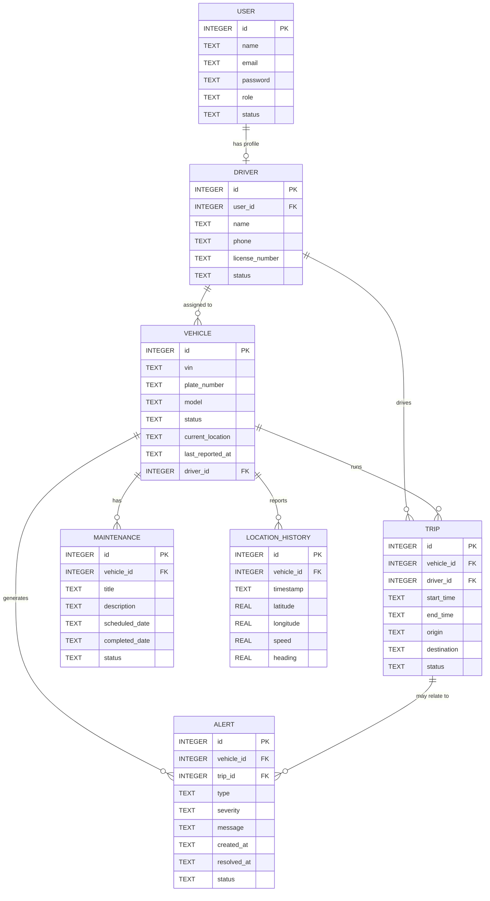

# ER Diagram

This diagram shows the MVP data model for the Vehicle Tracking & Fleet Monitoring Platform.

## Entity Descriptions

* `User`: stores login credentials, account status, and user role such as Admin, Fleet Manager, or Driver.
* `Driver`: stores driver-specific information including phone number and license details.
* `Vehicle`: stores fleet vehicle information, current status, current location, and assigned driver.
* `Trip`: records vehicle and driver assignments, journey origin, destination, start/end times, and trip status.
* `Alert`: records vehicle or trip-related events such as offline vehicles, over-speed conditions, and maintenance warnings.
* `Maintenance`: stores scheduled and completed maintenance activities for vehicles.
* `LocationHistory`: stores vehicle location points including latitude, longitude, speed, heading, and timestamp.

## User Roles

The `User` entity supports three main roles:

1. **Admin** – manages users and overall system operations.
2. **Fleet Manager** – manages vehicles, drivers, trips, maintenance, and fleet monitoring.
3. **Driver** – views assigned vehicle and trip information and updates trip-related status.

## Primary Keys and Foreign Keys

* `USER.id` → Primary Key
* `DRIVER.id` → Primary Key
* `DRIVER.user_id` → Foreign Key referencing `USER.id`
* `VEHICLE.id` → Primary Key
* `VEHICLE.driver_id` → Foreign Key referencing `DRIVER.id`
* `TRIP.id` → Primary Key
* `TRIP.vehicle_id` → Foreign Key referencing `VEHICLE.id`
* `TRIP.driver_id` → Foreign Key referencing `DRIVER.id`
* `ALERT.id` → Primary Key
* `ALERT.vehicle_id` → Foreign Key referencing `VEHICLE.id`
* `ALERT.trip_id` → Foreign Key referencing `TRIP.id`
* `MAINTENANCE.id` → Primary Key
* `MAINTENANCE.vehicle_id` → Foreign Key referencing `VEHICLE.id`
* `LOCATION_HISTORY.id` → Primary Key
* `LOCATION_HISTORY.vehicle_id` → Foreign Key referencing `VEHICLE.id`
