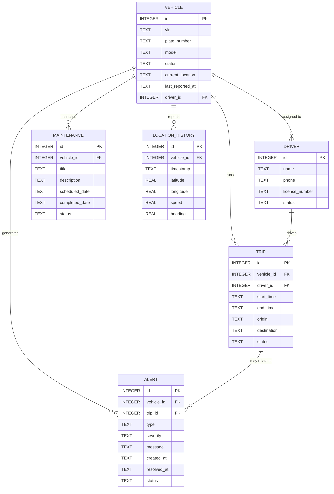

# ER Diagram

This diagram shows the MVP data model for the vehicle tracking and fleet monitoring system.

## Entity descriptions
- `Vehicle`: stores each fleet asset, current status, and assigned driver.
- `Driver`: stores driver details and license information.
- `Trip`: logs journey start/end, origin/destination, and assignment.
- `Alert`: records exceptions such as offline vehicles, over-speed, and maintenance warnings.
- `Maintenance`: tracks scheduled and completed vehicle work.
- `LocationHistory`: stores GPS points and speed history for vehicles.
